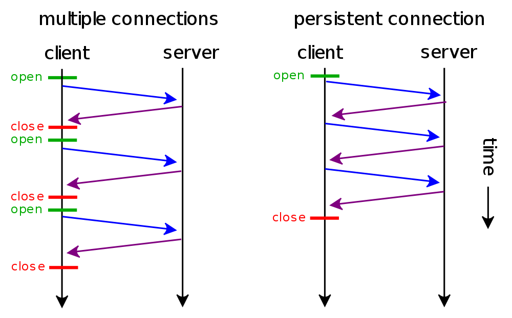

### 1. XMLHttpRequestd 对象发送请求的步骤, 使用`get`和`post`方法举例?

1.  创建 xhr 实例
2.  open 一个请求
3.  设置 header
4.  send 请求
5.  如果满足条件可以 abort

**get()同步示例:**

```js
var xhr = new XMLHttpRequest();
xhr.open("get", "example.txt", false);
xhr.setRequestHeader("MyHeader", "MyValue");
xhr.send(null);
if ((xhr.status >= 200 && xhr.status < 300) || xhr.status == 304) {
  alert(xhr.responseText);
} else {
  alert("Request was unsuccessful: " + xhr.status);
}
```

**get()异步示例:**

```js
var xhr = new XMLHttpRequest();
xhr.onreadystatechange = function() {
  if (xhr.readyState == 4) {
    if ((xhr.status >= 200 && xhr.status < 300) || xhr.status == 304) {
      alert(xhr.responseText);
    } else {
      alert("Request was unsuccessful: " + xhr.status);
    }
  }
};

xhr.open("get", "example.txt", true);
xhr.setRequestHeader("MyHeader", "MyValue");
xhr.send(null);
```

**post()示例:**

```js
var xhr = new XMLHttpRequest();
xhr.onreadystatechange = function() {
  if (xhr.readyState == 4) {
    if ((xhr.status >= 200 && xhr.status < 300) || xhr.status == 304) {
      alert(xhr.responseText);
    } else {
      alert("Request was unsuccessful: " + xhr.status);
    }
  }
};

xhr.open("post", "postexample.php", true);
// 模拟表单
xhr.setRequestHeader("Content-Type", "application/x-www-form-urlencoded");
var form = document.getElementById("user-info");
xhr.send(serialize(form));
```

**注意点:**

* 如果是相对路径, 则 URL 相对于执行代码的当前页面
* 调用** `open()` 方法并不会真正发送请求， 而只是启动一个请求以备发送**
* 调用 `send()` 之后，请求就会被分派到服务器
* 通过`xhr.status`来检测返回状态, responseText 返回响应结果
* 异步需要注册`xhr.onreadystatechange`回调, 通过`xhr.readyState`查看请求状态(0: 请求未初始化; 1: 请求已建立但未发送; 2: 请求已发送在处理; 3: 请求在处理, 数据没全部接受, 可多次触发; 4: 响应已完成;), 通过`xhr.status`判断结果状态
* 在接收到响应之前还可以调用 `abort()` 方法来取消异步请求, 执行之后 XHR 不再触发事件.
* 要成功发送请求头部信息，必须在调用 open()方法之后且调用 send()方法 之前调用 setRequestHeader()
* 只有部分的浏览器头部信息可以重写, 这个和浏览器有关
* 如果设置了超时, 则超时后会触发`xhr.readyState == 4`的状态, 但是 xhr 对象不可再访问, 建议在 try-catch 包裹

### 2. 上传文件的思路是什么, 如何给出进度信息?

* onloadstart 事件开始
* onprogress 事件在接收期间不断响应

### 3. 解释下跨域?

当协议(protocol)/IP/端口(port)三者一个不相同就出现跨域.

### 4. Preflight Request 是什么? 跨域时发送的`OPTIONS`请求的原因?

**CORS**（Cross-Origin Resource Sharing，跨源资源共享）背后的基本思想:

> **使用自定义的 HTTP 头部让浏览器与服务器沟通, 从而决定请求或响应是应该成功, 还是应该失败.**

CORS 通过 Preflight Request 机制向服务器验证请求. 这种请求使用`OPTIONS`方法发送, 包含:

* Origin：与简单的请求相同。
* Access-Control-Request-Method：请求自身使用的方法。
* Access-Control-Request-Headers：（可选）自定义的头部信息，多个头部以逗号分隔。

服务器根据发来的请求判断是否回应, 如果回应则发送下列信息:

* Access-Control-Allow-Origin：与简单的请求相同。
* Access-Control-Allow-Methods：允许的方法，多个方法以逗号分隔。
* Access-Control-Allow-Headers：允许的头部，多个头部以逗号分隔。
* Access-Control-Max-Age：应该将这个 Preflight 请求缓存多长时间（以秒表示）。

为此付出的代价**只是第一次发送这种请求时会多一次 HTTP 请求**.

> 注意:
>
> 1.  这个机制, **IE 10 及更早版本**都不支持
> 2.  这个过程一般是**不携带 cookie 等信息**, 除非设置`xhr.withCredentials=true`
> 3.  如果发送的是带凭证的请求但是服务器响应中没包含这个头部, 则浏览器就不会把响应交给 JavaScript. 于是，responseText 中将是空字符串，status 的值为 0，而且会调用 onerror()事件处理程序

### 5. 使用 axios 在 IE10-跨域发送`option`无法携带 cookie 等验证信息怎么解决?

在 IE10-中, 当 axios 在检测到发送的是跨域请求时(非同源), 使用的是微软特殊的 XDomainRequest 而不是一般的 XMLHttpRequest 实现的, XDomainRequest 在请求时为了安全会做出以下限制:

* cookie 不会随之发送
* 只能设置请求头部信息中的 Content-Type 字段
* 不能访问响应头部信息
* 只支持 GET 和 POST 请求

因此, 在 IE10-情况下, 跨域验证只能想别的办法. 如果是其余浏览器, 需要将`withCredentials`手动设置为 true, 可以指定某个请求应该发送凭据.

> axios 中`xhr.withCredentials`默认为`false`

### 6. 跨域联调需要做好哪些设置?

1.  服务端需要设置好`Access-Control-Allow-Origin`规则,
2.  如果需要在`OPTIONS`发送额外验证信息, 需要开启`xhr.withCredentials`属性, 这个属性只在 IE11+上有用, 默认为`false`
3.  如果是内部联调, 开发可以使用代理转发的方式避免跨域
4.  如果跨域请求并携带 cookie 验证, 服务端验证通过但客户端还是报错, 需要检查下服务端是否返回这个: `Access-Control-Allow-Credentials: true`

### 7. 有些网页功能只能在内网环境下工作, 在外网需要隐藏, 这个功能如何实现?

> 提示: 内网可能会有多个 ip/端口/内部域名, 但共同点是内网在外部都无法访问.

使用图像 ping 方式. 尝试请求内网的图片, 如果成功执行`onload`回调, 如果失败执行`onerror`回调.

```js
var img = new Image();
img.onerror = function() {
  alert("Error!");
};
img.onload = function() {
  alert("Done!");
};
img.src = "http://www.example.com/test?name=Nicholas";
```

### 8. 如何统计 JSDK 的使用信息?

使用图像 ping 方式. 请求远程服务的 gif 图片并在 url 参数中携带使用信息.

### 9. JSONP 的实现方式及存在的问题?

* callback 函数需要放到 window 上(全局)
* 外部源如果不安全会出现漏洞, XSS/CSRF 等

### 10. JSONP 和 Ajax 的关系?

两者没关系.

JSONP 过程:

* 创建 JS 脚本
* 向服务端请求数据并在 url 参数中携带 callback 函数,
* 服务器获得请求将 callback 对应的函数名与数据结合发送给客户端
* 脚本加载完成, 客户端执行 callback 函数并处理包含的数据

### 11. Comet, 长轮询和短轮询的过程及问题点?

有两种实现 Comet 的方式：轮询和流. 轮询分为长轮询和短轮询.

**短轮询:**

客户端定时发送请求.

**长轮询:**

客户端发送请求, 服务端有数据后再返回, 客户端接收后随即再发起请求.

**HTTP 流**

流不同于上述两种轮询，因为它在页面的整个生命周期内只 使用一个 HTTP 连接。服务端不断向客户端吐数据, 客户端通过`xhr.readyState == 3` 截取收到的东西, 这里说明两个接口.

### 12. SSE 和 WebSockets 的区别

* SSE API(服务器发送事件), IE 不支持, 使用 XHR 也可以实现
* Web Sockets, 使用自定义协议, 双向通信, 需要专门服务器, 使用 SSE 和 XHR 可能实现

### 13. 如何保证接口安全, 可用的措施是?

为确保通过 XHR 访问的 URL 安全，通行的做法就是验证发送请求者是否有权限访问相应的资源。 有下列几种方式可供选择

* 要求以 SSL 连接来访问可以通过 XHR 请求的资源。
* 要求每一次请求都要附带经过相应算法计算得到的验证码。
* 都走 post 请求, 请求 body 加密(网易云音乐接口)

### 14. HTTP keep-alive 和 TCP keepalive 的区别?

#### HTTP 建立在 TCP 之上

TCP 协议对应于传输层，而 HTTP 协议对应于应用层，从本质上来说，二者没有可比性。

#### TCP keepalive

> **保活, 心跳, 检测连接错误**

双方建立交互的链接不一定一直存在数据交互, 期间使用保活报文探测对方是否还在. 中间过程会遇到防火墙等中间设备, 会对 TCP 保活产生影响.

#### HTTP keep-alive

> **连接复用**

在一个 TCP 链接上进行多次 HTTP 请求从而提高性能.

Httpd 守护进程，一般都提供了 keep-alive timeout 时间设置参数. 正常情况下, 一个 HTTP 产生的 TCP 链接在传送完最后一个响应后, 马上主动关闭响应的 TCP 链接, 但是设置了 timeout 后, httpd 守护进程会等待以下, 如果还未有数据交互, 则关闭 HTTP 连接.



HTTP1.0 中默认是关闭的，需要在 HTTP 头加入"Connection: Keep-Alive"，才能启用 Keep-Alive；HTTP1.1 中默认启用 Keep-Alive，加入"Connection: close "，才关闭。

#### 两者的关系

http keep-alive 与 tcp keep-alive，不是同一回事，意图不一样。http keep-alive 是为了让 tcp 活得更久一点，以便在同一个连接上传送多个 http，提高 socket 的效率。而 tcp keep-alive 是 TCP 的一种检测 TCP 连接状况的保鲜机制。

#### 参考

* [HTTP Keep-Alive 模式](https://www.cnblogs.com/laowenBlog/p/6096239.html)
* [Http keep-alive 分析](https://www.jianshu.com/p/e99e0e505c79)
