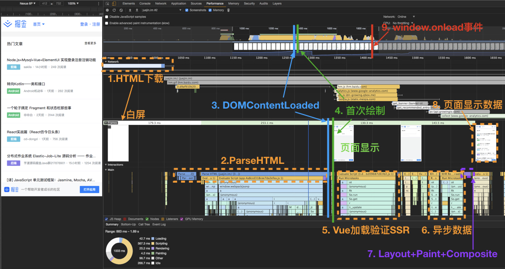

### 1. 什么是SSR？什么情况下需要使用SSR？

SSR（Server Side Render）**服务端渲染**，这里主要是为了解决SPA应用首屏<mark>加载缓慢、白屏</mark>的问题。用户在访问SPA应用时，服务端（Nodejs）先获取页面需要的数据**生成HTML字符串**传递给客户端用于首屏显示，随后再加载其余资源进行**渲染结果比对**和**后渲染**流程。

### 2. 传统SPA渲染过程和SSR渲染过程有何不同？

下面是两种方式的时序图：

**客户端渲染**

**服务端渲染**

**注意：**

- SSR可以在`window.onload` 事件前（css已在页面中，js等资源还未加载完）就能显示页面内容
- 对于同一个组件，服务端通过执行部分钩子代码完成“可视”部分渲染，不同框架不太一样

	- React：`componentWillMount/render `
	- Vue：`beforeCreate/create `

- 针对SSR，为了保证组件的完整生命周期及事件处理，客户端需要再次渲染（包括和客户端已有界面数据的比对校验）

### 3. 支持SSR的后端服务有哪些？

只有Nodejs。

### 4. Nodejs端和客户端为什么会有两个入口？

这里指的是`server.js/client.js`两个入口文件。

- 服务端需要开启服务，并通过路由导航到正确的页面
- 客户端就是完整的基于router的SPA
- 两个通过Router连接到公共代码

### 5. 两种方式的组件生命周期有何不等?

- 服务端：componentWillMount( node端 ) -> render( node端 )
- 客户端：SPA的方式

### 6. 拉取数据后如何处理呢？

- 服务端获取数据组装HTML页面
- 将组装页面用到的数据嵌入HTML中一同发送
- **客户端提取HTML中数据校验服务端HTML是否正确**，并初始化客户端Store

### 7. 上一步中，校验是如何进行的？

`ReactDOMServer.renderToString` 返回的HTML字符串带有自定义属性，例如：`data-reactid`、`data-react-checksum`。客户端从HTML中获取页面数据然后渲染计算得到的checksum与页面中的checksum比对，如果不一致则从新渲染，出现闪屏现象。

### 8. 生成两个入口的webpack配置如何不同？

- 前端：JSX+ES6/7 -> es5
- 后端：JSX+ES6/7 -> nodejs

### 9. 服务端如何知道path对应的页面应该使用哪个接口数据？

path -> match/RouterContext -> async获取数据 -> render组件 -> send

### 10. 客户端和服务端渲染不一致该如何排查？

服务端只执行`componentWillMount/render`两个钩子，因此不要在这里执行会存在差异的代码，比如平台判断等。

### 11. 掘金主页加载时的SSR示例

骨架Nuxt + 异步数据渲染

## 参考

- [React服务端渲染总结](https://www.cnblogs.com/BestMePeng/p/react_ssr.html)
- [美团点评点餐 Nuxt.js 实战](https://juejin.im/post/598aabe96fb9a03c335a8dde)
