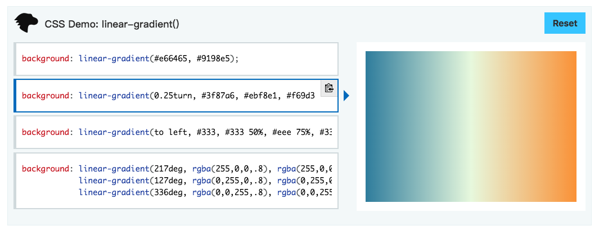

`linear-gradient()`是一个 CSS 函数，它能创建一个在多个颜色之间根据已知路径进行线性渐变的**图片**。没错，`linear-gradient()`是`<gradient>`类型的`<image>`图片，因此渐变函数无法应用于`<color>`的场景，比如：background-color。



此外，`linear-gradient()`没有内在维度、尺寸或者比例，它的具体尺寸将和对应元素尺寸匹配，如果希望创建能重复渐变的特性，可以使用`repeating-linear-gradient()`函数。

## 线性渐变是如何合成的？

我们需要清楚的一点是，**linear-gradient 是一个 css 函数**，具体的图形绘制是由底层机制处理。我们在这里能做的就是**理解传参原理和传参指纹**，解释这个过程你需要清楚这个图：


**理解渐变关键点：**

* 线性渐变的渐变路径是**一个穿过中心的一个轴（Gradient line）**，这个轴会有**角度和方向**
* 默认的方向是`to bottom`，如图所示的**starting point**和**ending point**
* starting point 表示第一个颜色开始的位置（以矩形框最远端点到 Gradient line 的垂直交点）
* ending point 表示最后一个颜色的位置
* **starting point**和**ending point**为中心对称结构
* 渐变将从 starting point 一直变化到 ending point，渐变线垂直 Gradient line
* 抛开上图矩形的边框的影响，因为 Gradient line 只和矩形中心有关
* 距离 starting point 和 ending point 最近的的**外框矩形直角**将会和对应的 starting point 和 ending point 有**相同的颜色**
* 我们需要在这个 Gradient line 上**指定多个确切的 color-stop 点**
* 如果只指定了 color，则 color 将**均分**starting point 和 ending point 之间的位置（**包括端点**，可以理解为端点为 0）
* color-stop 的位置可以使用`<length>`和`<percentage>`两个单位定义

## 语法结构

```
linear-gradient(
  [ <angle> | to <side-or-corner> ,]? <color-stop> [, <color-stop>]+ )
  \---------------------------------/ \----------------------------/
    Definition of the gradient line        List of color stops  

where <side-or-corner> = [left | right] || [top | bottom]
  and <color-stop>     = <color> [ <percentage> | <length> ]?
```

需要说明的是：

* `to <side-or-corner>`的默认值是`to bottom`

* `to <side-or-corner>`是`<angle>`的简写版，对应关系如下：
  * `to top` -> `0deg`
  * `to bottom` -> `180deg`
  * `to left` -> `270deg`
  * `to right` -> `90deg`
* `<angle>`的角度关系可以理解为时钟的指针
* 关于`<angle>`，0.25turn === 90deg

## 拓展

### `<image>`类型

[`<image>`类型](https://developer.mozilla.org/en-US/docs/Web/CSS/image)是 CSS 的一种数据类型，表示二维图形。图形可以为两种展现形式：**纯图片**，比如从`<url>`中提供；或者**动态生成**的图片，比如通过`<gradient>`。这样的类型可以被多个 css 属性使用，比如：

* [`background-image`](https://developer.mozilla.org/en-US/docs/Web/CSS/background-image)
* [`border-image`](https://developer.mozilla.org/en-US/docs/Web/CSS/border-image)
* [`content`](https://developer.mozilla.org/en-US/docs/Web/CSS/content)
* [`cursor`](https://developer.mozilla.org/en-US/docs/Web/CSS/cursor)
* [`list-style-image`](https://developer.mozilla.org/en-US/docs/Web/CSS/list-style-image)

#### 如何确定尺寸

1.  如果提供了具体的 width 和 height，则使用提供值确定图片尺寸，此时可能会有图片挤压拉伸。
2.  如果只提供了 width 或者 height，缺失部分就用图片固有比例展示。
3.  如果 width 和 height 都未提供，则使用图片默认尺寸比例展示，此时图片可能无法贴合外部容器。

#### 语法

`<image>`类型可以有三种引入方式：

1.  `<url>`引入，比如：url(test.jpg)
2.  linear-gradient()，比如：linear-gradient(blue, red)
3.  element(#id)，兼容性不足

### `<gradient>`类型

[渐变类型](https://developer.mozilla.org/en-US/docs/Web/CSS/gradient)是 image 类型的一种，他没有固定的尺寸和比例，最终尺寸将和定义它的元素尺寸匹配。

这种类型的 CSS 函数有：

* linear-gradient()

* radial-gradient()

* repeating-linear-gradient()

* repeat-radial-gradient()

## 参考

* [MDN Web Doc - linear-gradient()](https://developer.mozilla.org/en-US/docs/Web/CSS/linear-gradient)
