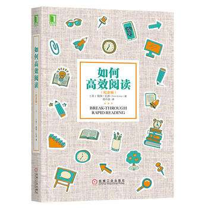

在读这本书的同时也是在进行高效阅读的实践，因为我性子比较急，做事强调结果，有很强的目的性。这样的性格特点和书中的一些观点结论不谋而合，下面进行总结回顾。

### 读书目的

带着目的或者问题看书，重点部分只占 20%，跳过不需要的。此外，关键点做好标记，便于为之后的结构化做准备。

### 结构化

书是思想的结晶，一般好书都是有系统的思维脉络，这可以通过画图（思维导图或其他）结构化知识体系。这样的方式也便于之后的回忆。

### 必须给时间回忆

回忆是让大脑在潜意识中对信息进行处理，条理化逻辑化，并加深对书中观点的记忆。这样的记忆积累有助于后面的阅读预测，便于下次遇到同类型知识点能快速跳过。

> 记忆是学习的基础！

### 预测

如果预测到了将要展开的部分就直接跳过，节省时间。

### 手指引读

如果注意力存在问题，可以使用此招集中注意力。

### 学会管理精力

把精力用在刀刃上能事半功倍，在精力充沛的时间读书，如果状态不行就试着跑跑步后再看书。
