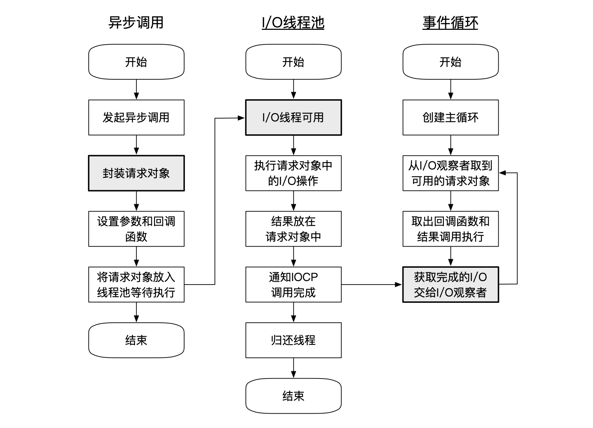
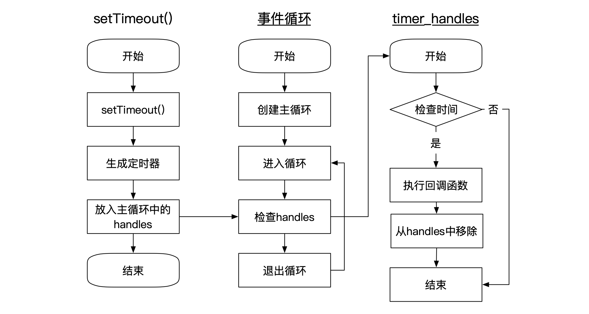

### 1. 从用户态发出异步I/O调用后，到回调函数被执行，中间发生了什么？

因为Node中的异步I/O调用不是有开发者自己调用的。示例代码如下：

```javascript
fs.open = function (path, flags, mode, callback) {
	// ...
  binding.open(
    pathModule._makeLong(path), 
    stringToFlags(flags), 
    mode, 
    callback
  );
  // ...
}
```

整个异步I/O的流程如下：



**请求对象、I/O线程池、观察者、 事件循环** 这四个共同构成了Node异步I/O模型的基本要素。大致流程：

1. 创建FSReqWrap**请求对象**，包括传参、当前方法、回调函数等都在请求对象中；
2. 将**请求对象**放入线程池中等待执行；
3. 线程执行完毕后，将**结果**存储在**请求对象**中，通知IOCP
4. 事件循环的观察者在**每次Tick**的执行中，调用IOCP相关方法查看是否有执行完毕的请求
5. 将**请求对象**放入I/O观察者队列，然后当做事件处理


### 2. Node应用是单线程还是多线程，如何理解？

JavaScript执行是单线程，但是Node本身是多线程的，比如I/O相关操作。


### 3. 非I/O的异步执行过程？

这里涉及的到异步API包括：**setTimeout()、setInterval()、setImmediate()、process.nextTick()** 这四个；整个过程以setTimeout()为例：



1. 创建setTimeout时，将定时器插入到定时观察者内部的**红黑树**中
2. 每次Tick执行是，会从改红黑树中取出定时器对象判定
3. 判定时间到了则执行定时器回调，否则跳过


**process.nextTick()** 与setTimeout（setInterval）类似，只是process.nextTick() 只会将回调函数放入队列中，在下一轮Tick时取出执行。时间效率**「O(1)」** 比setTimeout「O(logn)」高。


**setImmediate()**与process.nextTick()类似，但是process.nextTick()的优先级更高；具体来说：

1. process.nextTick()回调函数保存在数组中；setImmediate()保存在链表中
2. process.nextTick()每轮循环中会将数组中的回调函数全部执行完；setImmediate()在每轮循环中执行链表的一个回调函数（执行完毕后进入下一轮循环）
3. process.nextTick()是idle观察者，setImmediate()是check观察者；
   1. 优先级：idle观察者 -> I/O观察者 -> check观察者


